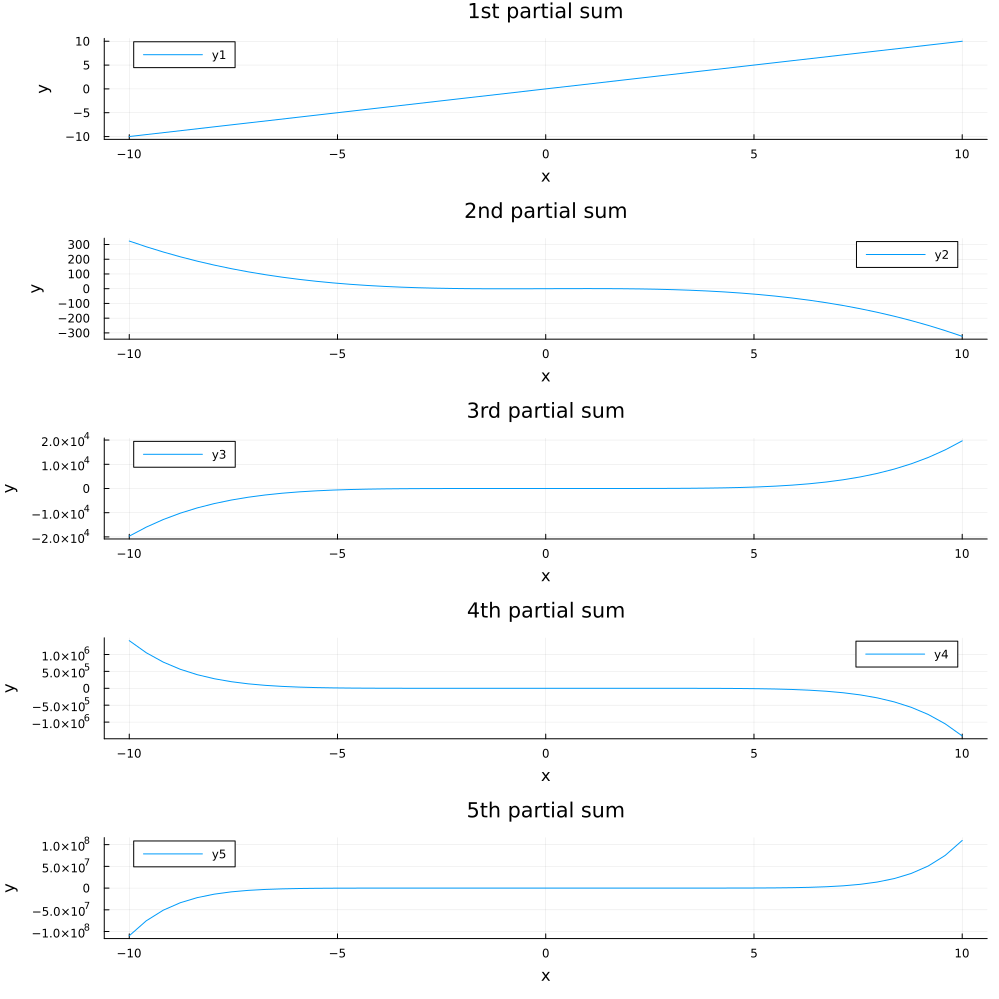

# Lab 1 (CSE 5361 Painter) - Drew Ripberger
The solutions are written in Julia.
## Computer Problem 1.1.4
### Code
```julia
using Printf
using PrettyTables

ns = map(x -> 8.0^x, 1:10)

approx = map(x -> (1 + (1/x))^x, ns)

@printf("exp(1) = %.15f\n", exp(1))
pretty_table([ns approx],
    tf=tf_markdown,
    header=(["n", "approx e"]),
    formatters=(ft_printf("%d", [1]), ft_printf("%.15f", [2]))
)
```
### Output
```
exp(1) = 2.718281828459045
|          n |          approx e |
|------------|-------------------|
|          8 | 2.565784513950348 |
|         64 | 2.697344952565099 |
|        512 | 2.715632000168991 |
|       4096 | 2.717950081189666 |
|      32768 | 2.718240351930294 |
|     262144 | 2.718276643766046 |
|    2097152 | 2.718281180370437 |
|   16777216 | 2.718281747447938 |
|  134217728 | 2.718281818332656 |
| 1073741824 | 2.718281827193247 |
```
### Discussion

My solution was written in Julia, and the output of the `exp(1)` function is shown on the first line of the output.
Assuming that `exp(1)` is correct to the 15 decimal places shown, I find it interesting that you'd have to go past n=8^10 to achieve an accurate value for *e* up to 15 decimal places. n=8^10 seems like a massive power to take to achieve 8 accurate digits. Granted we achieve a value that is quite close and probably recognizable at n=8^5.
Another interesting note is that for the most part it seems like each time you increase n by a power of 8, you achieve *about* one more decimal of precision. This doesn't look to hold between n=8^7 and n=8^8 though.

## Computer Problem 1.2.1
### Code
```julia
using Printf

function quad(a, b, c)
    disc = sqrt((b*b) - (4*a*c))
    ((-b-disc)/(2*a), (-b+disc)/(2*a))
end

println("x^2 + (10^8)x + 1 = 0 -> x=", quad(1, 100000000, 1))
println("x^2 + (10^8)x + 10^8 = 0 -> x=", quad(1, 100000000, 100000000))
```
### Output
```
x^2 + (10^8)x + 1 = 0 -> x=(-1.0e8, -7.450580596923828e-9)
x^2 + (10^8)x + 10^8 = 0 -> x=(-9.9999999e7, -1.0000000074505806)
```
### Discussion

$$ x = \frac{-b \pm \sqrt{b^2 - 4ac}}{2a}$$

$$ c = 1 $$

$$   = \frac{-10^8 \pm \sqrt{(10^8)^2 - 4(1)(1)}}{2(1)}$$

$$   \approx -1.00000*10^8,-1.00000*10^{-8} $$

$$ c = 10^8 $$

$$   = \frac{-10^8 \pm \sqrt{(10^8)^2 - 4(1)(10^8)}}{2(1)}$$

$$   \approx -1.00000*10^8,-1.00000 $$

The results from my program seem to be in line with the results I obtained by hand. In an absolute sense my results seem to be extremely close to the values I calculated by hand. This is also true for the most part when comparing the results in a relative sense. However, when looking at the larger of the two roots for c=1, that is extremely close to 0, the relative error is much larger since the values are so close to 0.


## Computer Problem 1.2.2

### Code
```julia
using Printf
using Plots

arctan(x, n) = sum(map((w, k) -> ((-1)^(k+1))*((w^((2*k)-1))/((2*k)-1)), fill(x, n), 1:n))

x = range(-10, 10, length=50)

y1 = arctan.(x, 1)
y2 = arctan.(x, 2)
y3 = arctan.(x, 3)
y4 = arctan.(x, 4)
y5 = arctan.(x, 5)

plot(x, [y1, y2, y3, y4, y5], 
    layout=(5, 1),
    title=["1st partial sum" "2nd partial sum" "3rd partial sum"
        "4th partial sum" "5th partial sum"],
    size=(1000,1000)
)

xlabel!("x")
ylabel!("y")
png("partial_sums.png")
```

### Output
