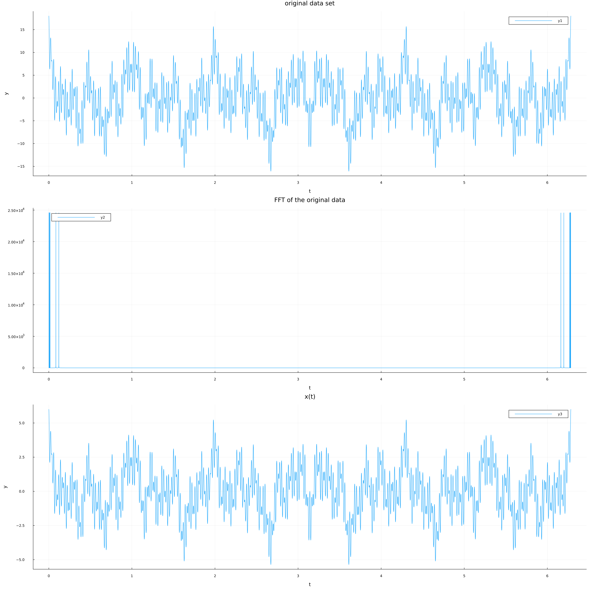

# Lab 2 (CSE 5361 Painter) - Drew Ripberger
The solutions are written in Julia.

## Code

```julia
# Numerical Methods Spring 2023
# Professor Nick Painter
#
# Author: Drew Ripberger

using Printf
using PrettyTables
using Polynomials
using CSV
using Plots
using DataFrames

# Implementation of the Fast Fourier Transform and its inverse
# Note: this implementation is not well optimized and is directly
#       written from our in class derivation and psuedocode
function fft(a)
    n = length(a)
    if n == 1
        a
    else
        a_e = a[1:2:end]
        a_o = a[2:2:end]
        y_o = fft(a_o)
        y_e = fft(a_e)

        w = 1
        psi = exp((2 * pi * 1im)/n)
        y = complex(zeros(Float64, n))
        for k = 1:(floor(Int64, n/2))
            y[k] = y_e[k] + w*y_o[k]
            y[k + floor(Int64, n/2)] = y_e[k] - w*y_o[k]
            w = w * psi
        end
        y
    end
end

function ifft_helper(a)
    n = length(a)
    if n == 1
        a
    else
        a_e = a[1:2:end]
        a_o = a[2:2:end]

        y_o = ifft_helper(a_o)
        y_e = ifft_helper(a_e)

        w = 1
        psi = exp((-2 * pi * 1im)/n)
        y = complex(zeros(Float64, n))
        for k = 1:(floor(Int64, n/2))
            y[k] = y_e[k] + w*y_o[k]
            y[k + floor(Int64, n/2)] = y_e[k] - w*y_o[k]
            w = w * psi
        end
        y
    end
end

function ifft(a)
    n = length(a)
    y = ifft_helper(a)
    y/n
end

function fast_polynomial_multiplication(a, b)
    la = length(a)
    lb = length(b)
    n = max(la, lb)
    if la < n 
        a = hcat(a, zeros(n-la))
    elseif length(b) < n
        b = hcat(b, zeros(n-lb))
    end
    a = hcat(a, zeros(n))
    b = hcat(b, zeros(n))
    N = 2*n
    A = fft(a)
    B = fft(b)
    C = complex(zeros(Float64, N))
    for k = 1:N
        C[k] = A[k] * B[k]
    end
    ifft(C)
end

# Horner's method
function poly_eval(a, x)
    n = length(a)
    res = a[n]
    for k = n-1:-1:1
        res *= x
        res += a[k]
    end
    res
end

p = [10, 4, 9, 5]
q = [9, 9, 2, 5]

println("fft(p) = ", fft(p))

println("p*q with fast polynomial mult = ", fast_polynomial_multiplication(p, q))

println("p*q with built in polynomial", Polynomial(p)*Polynomial(q))


df = CSV.read("SampleSignal.csv", DataFrame)


y_fft = fft(df.y)
y_abs_fft = collect(map(x -> abs(x), y_fft))

freq_domain = collect(zip(df.t, y_abs_fft, 1:length(df.t)))
max_y = maximum(y_abs_fft)
max_t = maximum(df.t)

dominant_freqs = filter(x -> x[2] > max_y/2, freq_domain)
scaled_dom_freqs = map(x -> ((x[1]*max_t)/(2 * pi), x[2], x[3]), 
        dominant_freqs[1:floor(Int64, length(dominant_freqs)/2)])
dmf = map(x->x[3], scaled_dom_freqs)
cos_wave = (x, t) -> sum(map(n -> cos((n-1)*t), x))

x = range(0, max_t, length=16384)
y = map(i->cos_wave(dmf, i), x)

plot(df.t, [df.y, y_abs_fft, y],
    layout=(3,1),
    title=["original data set" "FFT of the original data" "x(t)"],
    size=(2000,2000),
)

xlabel!("t")
ylabel!("y")
png("signal.png")
```

## Output

```
fft(p) = ComplexF64[28.0 + 0.0im, 0.9999999999999999 - 1.0im, 10.0 + 0.0im, 1.0 + 1.0im]
p*q with fast polynomial mult = ComplexF64[90.0 + 1.3766765505351941e-14im,
    126.0 - 1.425677897017003e-14im, 137.0 + 7.549516567451064e-15im,
    184.0 + 4.592425496802574e-17im, 83.0 - 1.4654943925052066e-14im,
    55.0 + 1.4164930460233978e-14im, 25.0 - 6.661338147750939e-15im,
    0.0 + 4.592425496802574e-17im]
p*q with built in polynomial90 + 126*x + 137*x^2 + 184*x^3 + 83*x^4 + 55*x^5 + 25*x^6
```
